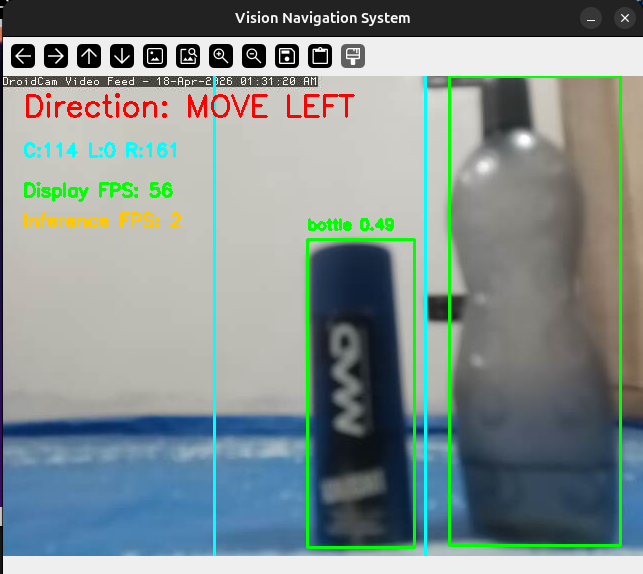
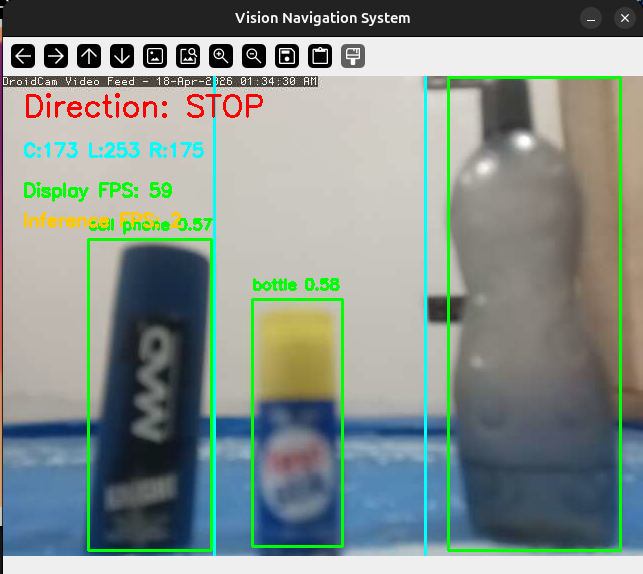
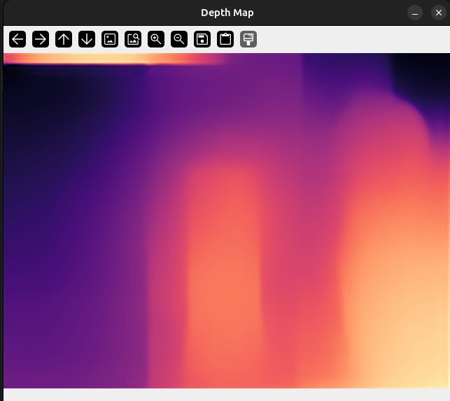

# Vision-Based Obstacle Avoidance System using YOLOv8 and Depth Estimation

## Overview

This project implements a real-time vision-based obstacle detection and avoidance system using a laptop or mobile phone camera.

The system detects obstacles using YOLOv8 object detection and estimates depth using MiDaS depth estimation, enabling intelligent navigation decisions such as:

- FORWARD
- MOVE LEFT
- MOVE RIGHT
- STOP

This simulates robot-like navigation using only a camera, without requiring Arduino or physical robots.

---

## Screenshots

### Main Navigation Output

### Depth Map Visualization (MiDaS)

---

## Features

- Real-time object detection using YOLOv8
- Monocular depth estimation using MiDaS
- Zone-based obstacle mapping (LEFT, CENTER, RIGHT)
- Intelligent navigation decision engine
- Empty-lane priority logic
- Frame-skipping optimization for CPU performance
- Low-latency camera streaming
- Real-time FPS monitoring
- Works without GPU (CPU-only system)
- Supports laptop webcam and mobile phone camera

---

## System Architecture

Camera Input  
↓  
Object Detection (YOLOv8)  
↓  
Depth Estimation (MiDaS)  
↓  
Obstacle Mapping  
↓  
Decision Engine  
↓  
Navigation Output  

---

## Technologies Used

- Python  
- OpenCV  
- PyTorch  
- YOLOv8 (Ultralytics)  
- MiDaS Depth Estimation  
- NumPy  

---

## Installation

Clone the repository:

    git clone https://github.com/YOUR_USERNAME/vision-navigation-system.git
    cd vision-navigation-system

Create virtual environment:

    python3 -m venv .venv
    source .venv/bin/activate

Install dependencies:

    pip install -r requirements.txt

---

## Model Setup

The required models download automatically on first run.

- YOLOv8 (here nano model) model downloads automatically using Ultralytics
- MiDaS (here small model) depth model downloads automatically via PyTorch

Ensure internet connection is available during the first run.

---

## Usage

Run the system:

    python main.py

---

## Camera Setup

You can use either:

Option 1 — Laptop Webcam:

    cap = initialize_camera(0)

Option 2 — Mobile Phone Camera (Recommended):

Use apps such as:

- IP Webcam  
- DroidCam  

Update stream URL in main.py:

    STREAM_URL = "http://YOUR_PHONE_IP:PORT/video"

Example:

    STREAM_URL = "http://192.168.29.221:4747/video"

Then run:

    python main.py

---

## Performance

Typical performance on CPU-only systems:

    Display FPS   : 40–60
    Inference FPS : 2–git comm3
    Latency       : ~0.5 seconds
    Hardware      : 8GB RAM, CPU-only laptop

Optimization techniques used:

- Frame skipping  
- Camera buffer flushing  
- Resolution scaling  
- Lightweight YOLO model  
- Depth inference optimization  

---

## Example Output

The system displays:

- Detected objects using YOLOv8  
- Depth visualization map  
- Navigation directions:
  - FORWARD
  - MOVE LEFT
  - MOVE RIGHT
  - STOP
- FPS metrics  
- Zone-based obstacle analysis:
  - LEFT
  - CENTER
  - RIGHT  

---

## Applications

- Autonomous navigation research  
- Assistive mobility systems  
- Robotics simulation  
- Smart mobility systems  
- Computer vision learning  
- Real-time obstacle detection systems  

---

## Future Improvements

- Return-to-center navigation  
- Path memory enhancement  
- GPU acceleration support   
- Advanced path planning  

---

## Project Highlights

- Real-time AI vision pipeline  
- YOLOv8 object detection integration  
- MiDaS depth estimation  
- CPU-optimized inference system  
- Intelligent obstacle avoidance logic  
- Low-latency streaming integration  
- Modular architecture design  
- Mobile camera compatibility  

---

## Hardware Requirements

Minimum:

- CPU-based system  
- 8 GB RAM  
- Laptop webcam or mobile phone camera  
- Internet connection (first run only)  

---

## Project Structure

vision_navigation_system/
│
├── main.py
├── models/
    ├──yolo_detector.py
    ├──depth_estimator.py
├── images/
├── navigation/
    ├──decision_engine.py
    ├──navigation_memory.py
    ├──obstacle_mapper.py
├── utils/
    ├──camera.py
    ├──visualization.py
├── requirements.txt
├── README.md
├── .gitignore

---

## Author

Apoorv Gupta  
B.Tech Computer Science and Engineering

